# Learn TCP/IP Networking From the Ground Up

A complete beginner's guide to understanding how computers talk to each other.

---

## Part 1: The Big Picture

### What Is Networking?

Imagine you want to send a letter to a friend in another city. You write the letter, put it in an envelope, add your friend's address, drop it in a mailbox, and somehow—through a system you don't fully understand—it arrives at your friend's door days later.

Computer networking works the same way. When you load a webpage, your computer sends a "letter" (a request) to another computer somewhere in the world, and that computer sends back another "letter" (the webpage content). This happens billions of times per second across the planet.

TCP/IP is the set of rules that makes this possible. It's the postal system of the internet.

### Why Should You Care?

If you're building software that communicates over a network—a web server, a chat application, a game, or anything that sends data between computers—understanding TCP/IP helps you:

- Debug mysterious connection problems
- Write faster, more efficient code
- Understand why things sometimes fail
- Make better design decisions

Let's start from the very beginning.

---

## Chapter 1: Introduction to Networking Concepts

### 1.1 Layering: Dividing a Complex Problem

Sending data across a network is complicated. Rather than trying to solve everything at once, engineers divided the problem into layers. Each layer handles one specific job and relies on the layer below it.

Think of it like mailing a package internationally:

1. **You** write a letter and put it in a box
2. **The shipping company** adds tracking labels and handles domestic transport
3. **Customs** handles crossing borders
4. **The local postal service** delivers to the final address

Each step doesn't need to know how the others work. The customs officer doesn't care what's in your letter. The local mail carrier doesn't know it crossed an ocean. This separation makes the system manageable.

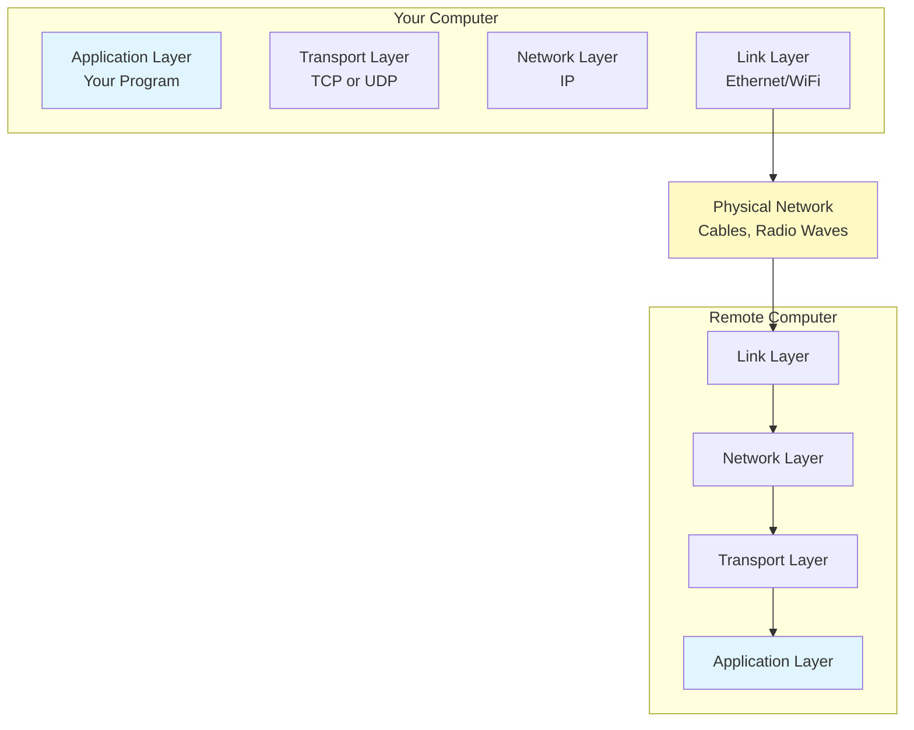

### 1.2 The TCP/IP Layer Model

TCP/IP uses four layers. From top to bottom:

| Layer | What It Does | Real-World Analogy |
|-------|--------------|-------------------|
| **Application** | Your program's logic | Writing the letter's content |
| **Transport** | Reliable or fast delivery | Choosing registered mail vs. postcard |
| **Network (IP)** | Routing across the internet | The postal routing system |
| **Link** | Physical transmission | The mail truck driving down the street |

When you send data:
- Your application creates the message
- The transport layer packages it for delivery
- The network layer addresses it for routing
- The link layer puts it on the wire

When you receive data, the process reverses.

### 1.3 Internet Addresses (IP Addresses)

Every device on a network needs a unique address, just like every house needs a street address for mail delivery.

An **IPv4 address** looks like this: `192.168.1.100`

It's four numbers (0-255) separated by dots. That's 32 bits total, allowing for about 4.3 billion unique addresses.

Some addresses are special:
- `127.0.0.1` — "localhost," your own computer talking to itself
- `192.168.x.x`, `10.x.x.x` — private addresses used inside homes and offices
- `8.8.8.8` — Google's public DNS server (we'll explain DNS later)

**IPv6** addresses are longer (128 bits) and look like `2001:0db8:85a3:0000:0000:8a2e:0370:7334`. They exist because we're running out of IPv4 addresses, but IPv4 is still dominant.

### 1.4 Encapsulation: Wrapping Data in Layers

When data travels down through the layers, each layer wraps the data in its own header—like putting a letter in an envelope, then putting that envelope in a shipping box, then putting that box in a cargo container.

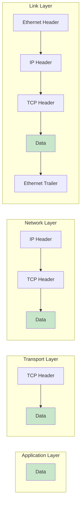

Each header contains information that layer needs:
- **Ethernet header**: Which device on the local network?
- **IP header**: Which computer on the internet?
- **TCP header**: Which application on that computer?
- **Data**: The actual content

When the data arrives, each layer strips off its header, reads the information, and passes the rest upward.

### 1.5 Demultiplexing: Delivering to the Right Application

Your computer might be running a web browser, an email client, a chat program, and a game—all at once, all using the network. When a packet arrives, how does the operating system know which program should receive it?

This is **demultiplexing**. Each layer uses its header information to make routing decisions:

1. The link layer checks: "Is this for my hardware address?"
2. The IP layer checks: "Is this for my IP address?"
3. The transport layer checks: "Which port number?"

The port number is the key. It identifies which application gets the data.

### 1.6 The Client-Server Model

Most network communication follows a pattern:

- A **server** waits, listening for incoming requests
- A **client** initiates contact, sending a request
- The server responds

When you browse the web:
- Your browser is the client
- The website's computer is the server

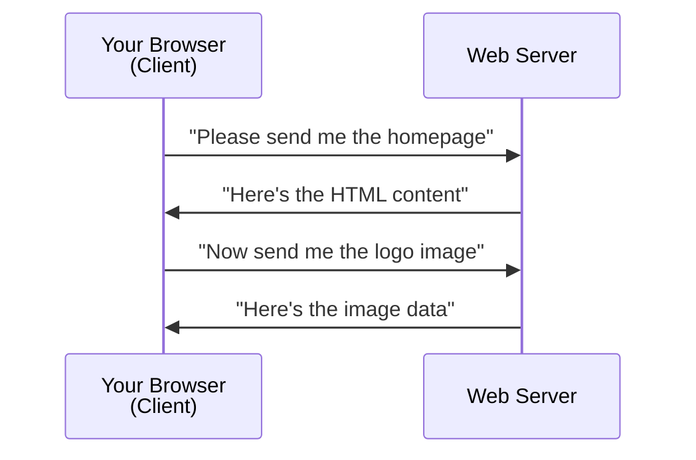

A single server can handle thousands of clients simultaneously. Your home computer can be a client to many different servers at once.

### 1.7 Port Numbers: Apartment Numbers for Computers

If an IP address is like a street address, a port number is like an apartment number. The IP address gets the data to the right building (computer), and the port number gets it to the right unit (application).

Port numbers range from 0 to 65535. Some are well-known:

| Port | Service |
|------|---------|
| 80 | HTTP (web) |
| 443 | HTTPS (secure web) |
| 22 | SSH (remote login) |
| 25 | SMTP (email sending) |
| 53 | DNS (name lookups) |

When your browser connects to `www.example.com`, it's really connecting to something like `93.184.216.34:443`—an IP address plus a port number.

Ports 0-1023 are "privileged" and typically reserved for system services. Your applications usually get assigned random high-numbered ports (like 52431) for outgoing connections.

### 1.8 Application Programming Interfaces (APIs)

You don't need to understand every detail of TCP/IP to use it. Operating systems provide **sockets**—a programming interface that hides the complexity.

With sockets, your code simply says:
- "Connect to this address and port"
- "Send this data"
- "Receive data"
- "Close the connection"

The operating system handles all the layering, headers, routing, and retransmission. You just work with a stream of bytes.

---

## Chapter 2: The Link Layer

### 2.1 MTU: Maximum Transmission Unit

Different types of networks have different limits on how much data can be sent in a single frame. This limit is called the **Maximum Transmission Unit (MTU)**.

For Ethernet (the most common wired network), the MTU is typically **1500 bytes**.

Why does this matter? If you try to send a 5000-byte message, it won't fit in one frame. Something has to break it into smaller pieces—this is called **fragmentation**.

Think of it like shipping a grand piano. It doesn't fit through a standard doorway, so you might need to disassemble it, ship the pieces separately, and reassemble at the destination.

### 2.2 Path MTU: The Smallest Link in the Chain

Data often travels through many networks to reach its destination. Each network might have a different MTU.

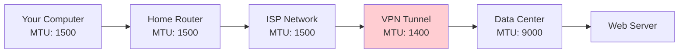

The **Path MTU** is the smallest MTU along the entire route. In the diagram above, even though most links support 1500 bytes, the VPN tunnel only supports 1400. That becomes the Path MTU.

If you send packets larger than the Path MTU, they'll need to be fragmented somewhere along the way—which adds overhead and can cause problems. Modern systems try to discover the Path MTU and avoid fragmentation entirely.

---

## Chapter 3: The Internet Protocol (IP)

### 3.1 The IP Header: Your Packet's Shipping Label

Every IP packet has a header containing routing information. The most important fields:

| Field | Purpose |
|-------|---------|
| Version | IPv4 or IPv6? |
| Total Length | Size of the entire packet |
| TTL (Time To Live) | How many hops before giving up |
| Protocol | What's inside? (TCP=6, UDP=17) |
| Source Address | Where this came from |
| Destination Address | Where it's going |

The **TTL** field prevents packets from circling forever if there's a routing loop. Each router decrements it by one. When it hits zero, the packet is discarded.

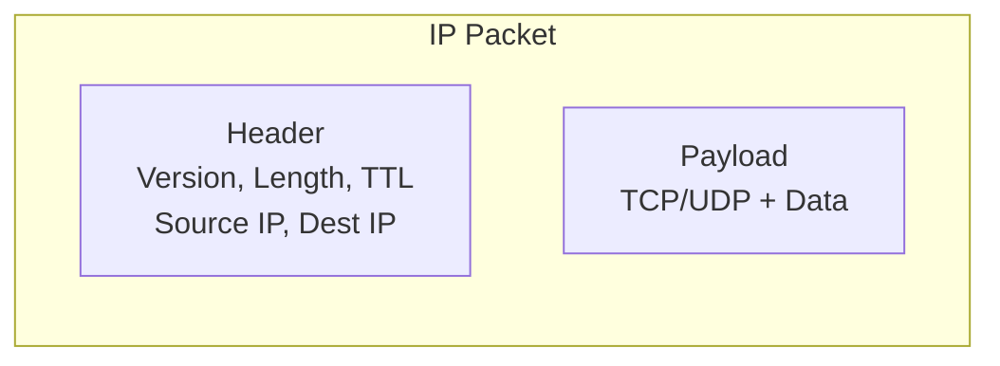

### 3.2 Subnet Addressing: Organizing Networks

Large organizations don't give every computer a completely different address. Instead, they divide their address space into **subnets**.

Think of it like a large apartment complex. The building has one main address (123 Main Street), but inside there are separate wings (A, B, C) and apartments within each wing.

An IP address has two parts:
- **Network portion**: Which network is this?
- **Host portion**: Which computer on that network?

### 3.3 Subnet Masks: Drawing the Line

A **subnet mask** defines where the network portion ends and the host portion begins.

For example:
- IP Address: `192.168.1.100`
- Subnet Mask: `255.255.255.0`

The mask `255.255.255.0` means the first three numbers (`192.168.1`) identify the network, and the last number (`100`) identifies the specific host.

You'll often see this written as `192.168.1.100/24`—the `/24` means the first 24 bits are the network portion.

This helps routers make decisions quickly: "Is this address on my local network, or do I need to forward it elsewhere?"

---

## Chapter 4: UDP—The Simple, Fast Protocol

### 4.1 What UDP Does

**UDP (User Datagram Protocol)** is the simpler of the two main transport protocols. It offers:

- Fast delivery
- No connection setup
- No guarantee of delivery
- No guarantee of order

It's like sending a postcard: quick and easy, but if it gets lost, nobody tells you.

### 4.2 The UDP Header

UDP's header is tiny—just 8 bytes:

| Field | Size | Purpose |
|-------|------|---------|
| Source Port | 2 bytes | Which app sent this |
| Destination Port | 2 bytes | Which app should receive |
| Length | 2 bytes | Total size of UDP packet |
| Checksum | 2 bytes | Error detection |

That's it. No sequence numbers, no acknowledgments, no flow control.

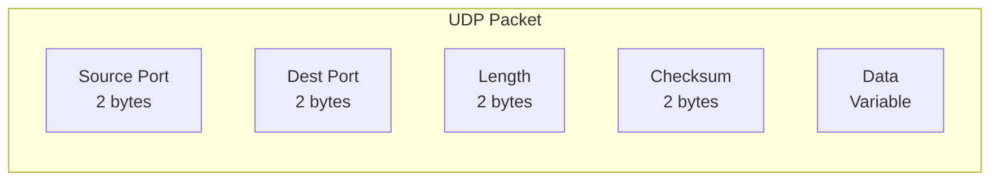

### 4.3 The UDP Checksum

The checksum catches transmission errors. The sender computes a mathematical summary of the data; the receiver computes the same thing and compares. If they don't match, the packet was corrupted and gets discarded.

But UDP doesn't request retransmission—it just throws away bad packets.

### 4.4 IP Fragmentation

What happens when you send a UDP datagram larger than the Path MTU?

The IP layer **fragments** it—breaks it into smaller pieces that each fit within the MTU. Each fragment travels separately and gets reassembled at the destination.

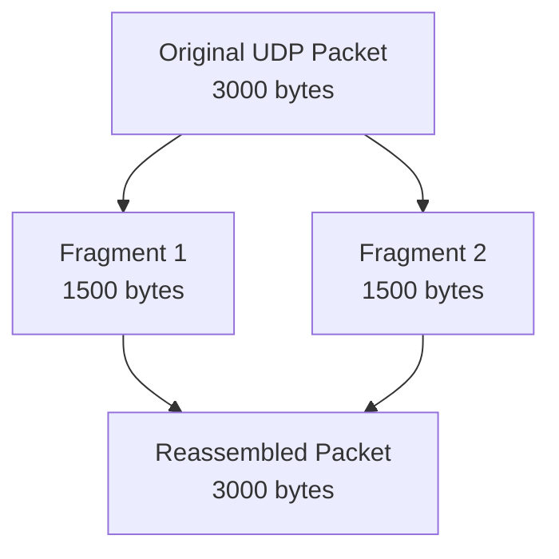

Fragmentation has downsides:
- If any fragment is lost, the entire datagram is lost
- More overhead (each fragment needs its own IP header)
- Some firewalls block fragments

Modern applications try to avoid fragmentation by keeping their UDP datagrams under the Path MTU.

### 4.5 Path MTU Discovery with UDP

Your application can discover the Path MTU by:
1. Sending packets with the "Don't Fragment" flag set
2. Listening for "Fragmentation Needed" error messages
3. Reducing packet size until they get through

This lets you send the largest possible packets without fragmentation.

### 4.6 Maximum UDP Datagram Size

Theoretically, a UDP datagram can be up to 65,535 bytes (limited by the 16-bit length field).

Practically, you should stay much smaller:
- Over the internet: ~1472 bytes (1500 MTU minus headers)
- For reliability: even smaller, around 512-1400 bytes

Larger datagrams have a higher chance of fragmentation and loss.

### 4.7 UDP Server Design

A UDP server is simple:
1. Create a socket bound to a port
2. Wait for incoming datagrams
3. Process each one independently
4. Send responses back

Because there's no connection state, a single UDP socket can communicate with thousands of clients simultaneously.

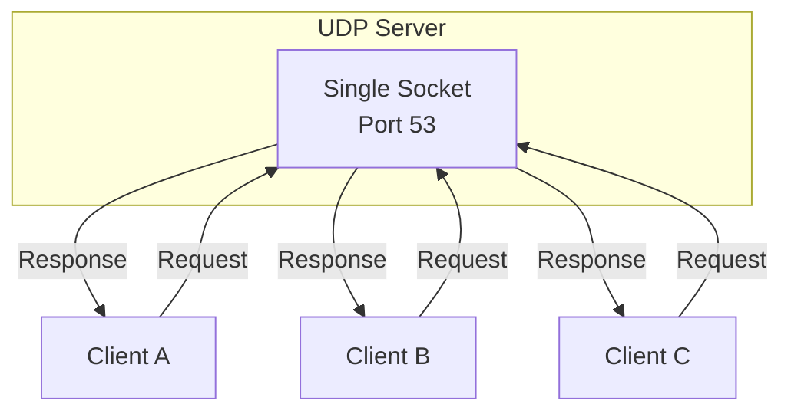

UDP is great for:
- DNS lookups (fast, short queries)
- Video streaming (old data is useless, just show the latest)
- Gaming (quick updates more important than perfect reliability)
- Voice/video calls (latency matters more than occasional glitches)

---

## Chapter 5: DNS—Turning Names into Addresses

### 5.1 DNS Basics

Humans remember names like `www.google.com`. Computers need numbers like `142.250.80.4`. **DNS (Domain Name System)** translates between them.

When you type a URL in your browser:
1. Your computer asks: "What's the IP address for www.google.com?"
2. A DNS server responds: "It's 142.250.80.4"
3. Your browser connects to that IP address

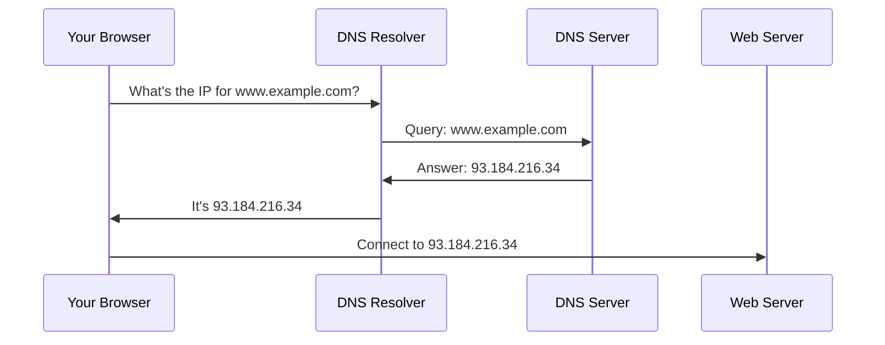

DNS is hierarchical. To find `www.example.com`:
1. Ask a root server: "Who handles `.com`?"
2. Ask the `.com` server: "Who handles `example.com`?"
3. Ask the `example.com` server: "What's `www`?"

In practice, caching makes this much faster.

### 5.2 DNS Caching

DNS answers include a **TTL (Time To Live)**—how long the answer can be cached.

Your computer caches DNS responses. Your home router caches them. Your ISP caches them. This dramatically reduces DNS traffic and speeds up lookups.

The downside: if a website changes its IP address, old cached entries might point to the wrong place until they expire.

### 5.3 DNS: UDP or TCP?

DNS typically uses **UDP** on port 53. Most queries and responses fit in a single packet, so UDP's speed advantage outweighs TCP's reliability.

DNS switches to **TCP** when:
- The response is too large for one UDP packet (over ~512 bytes)
- Zone transfers between DNS servers
- Higher reliability is required

Modern DNS extensions (like DNSSEC) often produce larger responses, so TCP is becoming more common.

---

## Chapter 6: TCP—The Reliable Workhorse

### 6.1 What TCP Provides

**TCP (Transmission Control Protocol)** is the backbone of most internet communication. It provides:

- **Reliable delivery**: Lost data is automatically retransmitted
- **Ordered delivery**: Data arrives in the order it was sent
- **Flow control**: Sender won't overwhelm a slow receiver
- **Congestion control**: Won't flood the network

It's like sending registered mail with tracking and confirmation.

### 6.2 The TCP Header

TCP's header is more complex than UDP's (20 bytes minimum):

| Field | Purpose |
|-------|---------|
| Source Port | Sender's application |
| Destination Port | Receiver's application |
| Sequence Number | Position of this data in the stream |
| Acknowledgment Number | What we've received so far |
| Flags | SYN, ACK, FIN, RST, etc. |
| Window Size | How much data we can accept |
| Checksum | Error detection |

The sequence and acknowledgment numbers enable reliability. The window size enables flow control. The flags control connection state.

---

## Chapter 7: TCP Connections—Starting and Stopping

### 7.1 The Three-Way Handshake

TCP is **connection-oriented**. Before sending data, both sides must agree to communicate. This is the three-way handshake:

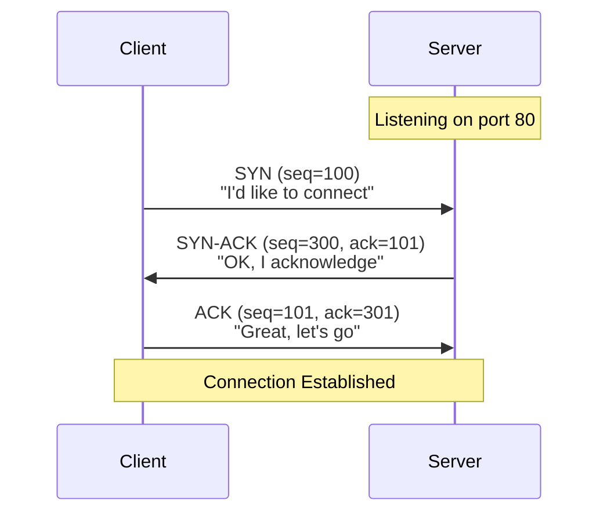

1. **Client sends SYN**: "I want to start a conversation. My starting sequence number is 100."
2. **Server sends SYN-ACK**: "I heard you. My starting sequence number is 300. I'm ready for your byte 101."
3. **Client sends ACK**: "I heard you. I'm ready for your byte 301."

Now both sides know the other is listening and have agreed on sequence numbers.

### 7.2 Connection Establishment Timeout

What if the server doesn't respond? The client retries the SYN packet several times, with increasing delays between attempts:

- First retry: 3 seconds
- Second retry: 6 seconds
- Third retry: 12 seconds
- ...and so on

If all retries fail, the connection attempt times out. This typically takes about 75 seconds.

### 7.3 Maximum Segment Size (MSS)

During the handshake, each side advertises its **Maximum Segment Size**—the largest chunk of data it can receive in one TCP segment.

This is usually MTU minus 40 bytes (for IP and TCP headers). On Ethernet: 1500 - 40 = **1460 bytes**.

By knowing each other's MSS, both sides can send appropriately-sized segments and avoid fragmentation.

### 7.4 TCP Half-Close

TCP connections are **bidirectional**—data flows both ways. Each direction can be closed independently.

A **half-close** means: "I'm done sending, but I'll still accept your data."

This is useful when a client sends a complete request and then waits for a lengthy response. The client can close its sending direction while keeping the receiving direction open.

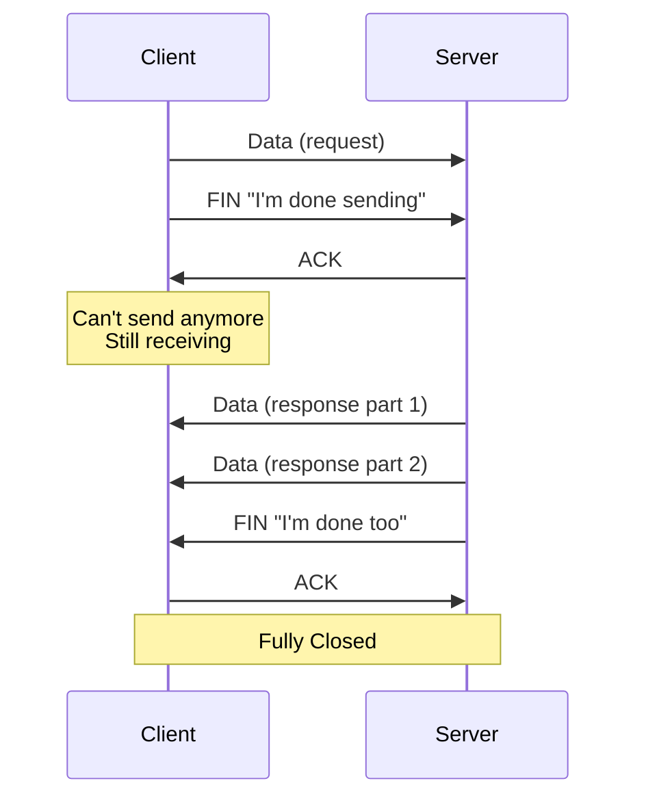

### 7.5 TCP State Transition Diagram

A TCP connection moves through states:

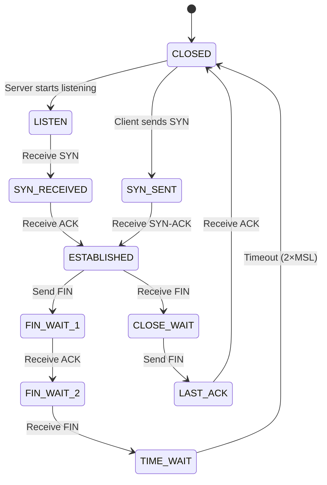

Understanding these states helps when debugging connection problems. If you see many connections stuck in `TIME_WAIT`, for example, you might be opening and closing connections too rapidly.

### 7.6 Reset Segments (RST)

Sometimes a connection needs to be terminated immediately, without the normal graceful close. A **RST (Reset)** segment says: "This connection is invalid. Stop immediately."

RST is sent when:
- A packet arrives for a connection that doesn't exist
- An application crashes without closing properly
- A firewall decides to kill a connection
- Something seriously wrong is detected

When you receive RST, the connection is dead. No acknowledgment is sent.

### 7.7 TCP Options

TCP's header can include options for additional features:

| Option | Purpose |
|--------|---------|
| MSS | Maximum Segment Size |
| Window Scale | Larger window sizes |
| Timestamp | Better RTT measurement |
| SACK | Selective acknowledgment |

These are negotiated during the handshake. Both sides must support an option to use it.

### 7.8 TCP Server Design

A TCP server follows this pattern:

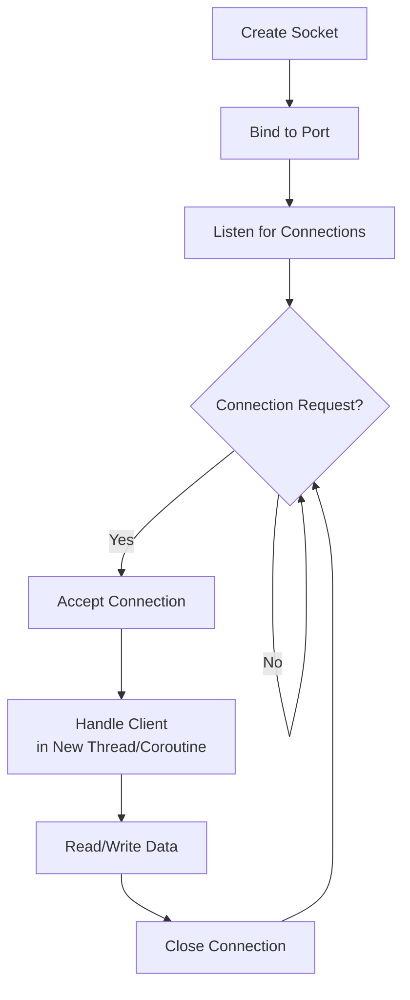

Unlike UDP, each TCP client gets its own connection. The server must manage multiple simultaneous connections, typically using threads, processes, or asynchronous I/O.

---

## Chapter 8: TCP Interactive Data Flow

### 8.1 Delayed Acknowledgments

TCP requires acknowledgment of received data. But sending an ACK for every single packet would be wasteful.

**Delayed acknowledgments** wait briefly (typically 200ms) before sending an ACK, hoping to combine it with outgoing data. If the application sends a response, the ACK piggybacks on it for free.

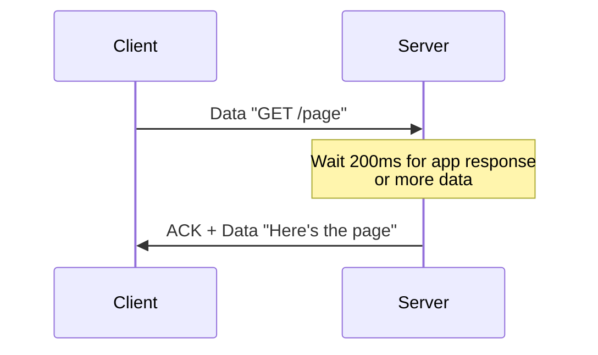

This reduces traffic but adds slight latency for one-way data flows.

### 8.2 The Nagle Algorithm

When an application sends data byte-by-byte (like typing in a terminal), sending each byte in its own packet would be incredibly wasteful—a 1-byte payload with 40 bytes of headers!

The **Nagle algorithm** buffers small writes:
- If there's unacknowledged data in flight, hold new small writes
- Combine them into a larger segment
- Send when an ACK arrives or enough data accumulates

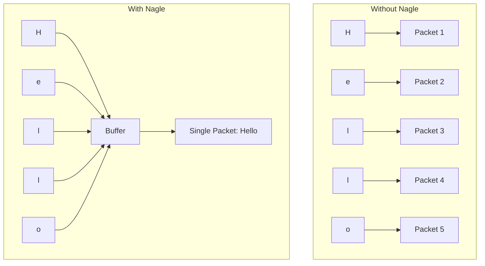

Nagle is great for interactive traffic but can add latency. Applications that need every byte sent immediately (like games) often disable it.

### 8.3 Window Size Advertisements

The receiver tells the sender how much buffer space is available using the **window size** field. This prevents the sender from overwhelming a slow receiver.

If the receiver's application is slow to read data, the window shrinks. The sender must slow down. When the receiver catches up, the window grows again.

---

## Chapter 9: TCP Bulk Data Flow

### 9.1 Normal Data Flow

When transferring large files, TCP sends many segments in a row without waiting for individual acknowledgments. The sender maintains a "window" of unacknowledged data in flight.

### 9.2 Sliding Windows

The **sliding window** is the core of TCP's efficiency:

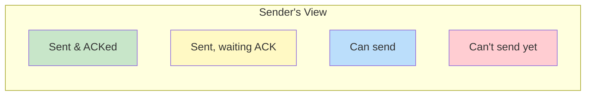

- **Green**: Data sent and acknowledged. Done.
- **Yellow**: Data sent, waiting for acknowledgment.
- **Blue**: Space available to send more data.
- **Red**: Must wait for acknowledgments before sending.

As ACKs arrive, the window "slides" forward, allowing more data to be sent.

### 9.3 Window Size

The window size is the smaller of:
- **Receiver's advertised window**: How much buffer space they have
- **Congestion window**: How much the network can handle (more on this later)

Larger windows mean more data in flight, which means higher throughput—especially on high-latency connections.

### 9.4 The PUSH Flag

The **PSH (Push)** flag tells the receiver: "Don't buffer this—deliver it to the application immediately."

TCP typically buffers incoming data for efficiency. PSH overrides this for latency-sensitive data.

### 9.5 Slow Start

TCP doesn't blast data at full speed immediately. It starts slowly and ramps up.

**Slow start** begins with a small congestion window (typically 1-10 segments). Each acknowledged segment doubles the window. This exponential growth quickly finds the available bandwidth.

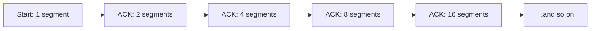

Once packet loss occurs (indicating congestion), TCP backs off and switches to more conservative growth.

### 9.6 Bulk Data Throughput

For large transfers, throughput depends on:
- **Bandwidth**: How fast the link is
- **Latency**: Round-trip time affects how fast the window can grow
- **Window size**: Limits data in flight
- **Packet loss**: Triggers slowdowns

The formula: `Throughput ≤ Window Size / Round-Trip Time`

A 64KB window with 100ms RTT: `65536 / 0.1 = 655KB/s` maximum, regardless of bandwidth.

---

## Chapter 10: TCP Timeout and Retransmission

### 10.1 Round-Trip Time Measurement

TCP must decide how long to wait before assuming a packet was lost. Too short: unnecessary retransmissions. Too long: wasted time.

TCP continuously measures **Round-Trip Time (RTT)**—how long until an ACK returns. It maintains a smoothed average and variance, adapting to changing network conditions.

### 10.2 Congestion

When too many packets flood a network, routers start dropping them. This is **congestion**.

Signs of congestion:
- Packets being dropped
- RTT increasing dramatically
- Timeout-based retransmissions

TCP interprets packet loss as a signal to slow down.

### 10.3 Congestion Avoidance

After slow start detects the network's limit, TCP switches to **congestion avoidance**—linear growth instead of exponential:

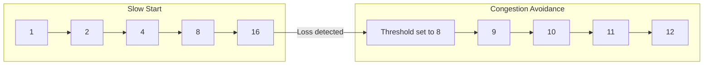

When loss occurs:
1. The threshold is set to half the current window
2. The window drops dramatically
3. Growth continues linearly

### 10.4 Fast Retransmit and Fast Recovery

Waiting for a timeout is slow. **Fast retransmit** detects loss earlier using duplicate ACKs.

If the receiver gets packet 1, then packet 3, it knows 2 is missing. It sends a duplicate ACK for 1 (what it's still waiting for). Three duplicate ACKs trigger immediate retransmission without waiting for timeout.

**Fast recovery** avoids resetting to slow start. Instead, the window is halved and growth continues.

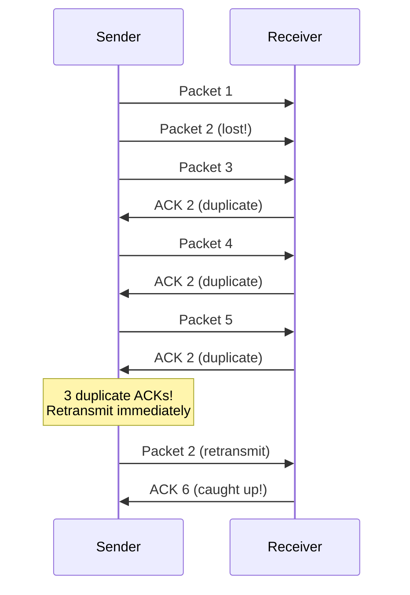

---

## Chapter 11: TCP Persist Timer

### 11.1 The Silly Window Syndrome

Imagine a receiver's buffer is full. It advertises a zero window: "Stop sending!" The sender waits. Eventually the receiver reads one byte and advertises a window of 1. The sender sends 1 byte. Now the buffer is full again...

This is **Silly Window Syndrome**—sending tiny packets because of constantly-full buffers. Horrendously inefficient.

Solutions:
- **Receiver**: Don't advertise tiny windows. Wait until at least half the buffer is free or a full MSS is available.
- **Sender**: Don't send tiny segments. Wait until enough data accumulates (Nagle algorithm).

The **persist timer** handles the case where the receiver's window is zero. The sender periodically sends tiny "probe" segments to check if the window has opened. This prevents deadlock where the sender waits forever and the receiver's "window open" message was lost.

---

## Chapter 12: TCP Keepalive Timer

### 12.1 Why Keepalive?

TCP connections can sit idle indefinitely. Neither side sends data, but the connection remains "open."

What if the other side crashes without closing properly? Or the network path fails? You'd never know—you'd wait forever for data that will never come.

**Keepalive** solves this by periodically probing idle connections.

### 12.2 How Keepalive Works

After a connection has been idle for a while (typically 2 hours):
1. Send an empty probe segment
2. If ACK received: connection is alive
3. If no response: retry several times
4. If still no response: declare the connection dead

This catches:
- Crashed peers
- Failed network paths
- Unplugged cables

Keepalive is optional and often disabled by default. Many applications implement their own heartbeat mechanisms instead.

---

## Chapter 13: TCP Performance and Modern Extensions

### 13.1 Path MTU Discovery

Remember Path MTU from the link layer? TCP uses it too.

TCP discovers the Path MTU by:
1. Sending segments with the "Don't Fragment" flag
2. If a router can't forward the packet, it sends an error message
3. TCP reduces its segment size and retries

This avoids fragmentation, which improves performance and reliability.

### 13.2 Long Fat Pipes

A **Long Fat Pipe** is a high-bandwidth, high-latency link. Think of a satellite connection: huge capacity, but 500ms round-trip time.

The problem: TCP's window is limited to 65,535 bytes (16-bit field). On a 10 Gbps link with 100ms RTT, you could have 125MB in flight—but the window only allows 64KB!

`Throughput ≤ 65535 / 0.1 = 655 KB/s` 

That's 0.005% of the available bandwidth. Unacceptable.

### 13.3 Window Scale Option

The **Window Scale** option multiplies the window size. A scale factor of 7 means the window field is shifted left 7 bits, allowing windows up to 1 GB.

Negotiated during the handshake, window scaling enables TCP to fully utilize high-bandwidth, high-latency links.

### 13.4 Timestamp Option

**Timestamps** improve RTT measurement and enable a protection mechanism.

Each segment includes a timestamp. The receiver echoes it back. This gives precise RTT measurements even when multiple segments are in flight.

### 13.5 PAWS: Protection Against Wrapped Sequence Numbers

TCP sequence numbers are 32-bit, giving about 4 billion unique values. At 10 Gbps, you burn through all sequence numbers in about 3 seconds!

What if old, delayed packets arrive with sequence numbers that have "wrapped around" and now look valid?

**PAWS (Protection Against Wrapped Sequence Numbers)** uses timestamps to detect this. A segment with an old timestamp is rejected, even if the sequence number looks valid.

### 13.6 TCP Performance Summary

For best TCP performance:

1. **Enable window scaling** for high-bandwidth links
2. **Enable timestamps** for accurate RTT and PAWS protection
3. **Tune buffer sizes** appropriately
4. **Minimize latency** where possible (it directly limits throughput)
5. **Avoid packet loss** (it triggers slowdowns)
6. **Use appropriate MSS** to avoid fragmentation

Modern operating systems configure most of this automatically, but understanding these mechanisms helps you diagnose problems and optimize critical applications.

---

## Conclusion

You now understand the fundamental concepts of TCP/IP networking:

- **Layering** divides the complex problem into manageable pieces
- **IP** routes packets across the internet
- **UDP** provides fast, simple, unreliable delivery
- **TCP** provides reliable, ordered delivery with flow and congestion control
- **DNS** translates names to addresses

When your code sends data across a network, all of this machinery springs into action—handshakes negotiating, windows sliding, timers ticking, packets routing through a maze of interconnected networks.

Understanding this foundation will help you write better networked software, debug mysterious failures, and appreciate the engineering marvel that makes the modern internet possible.
